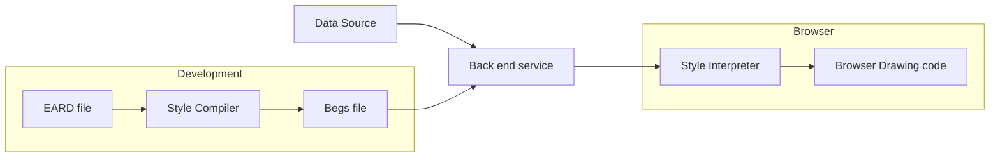
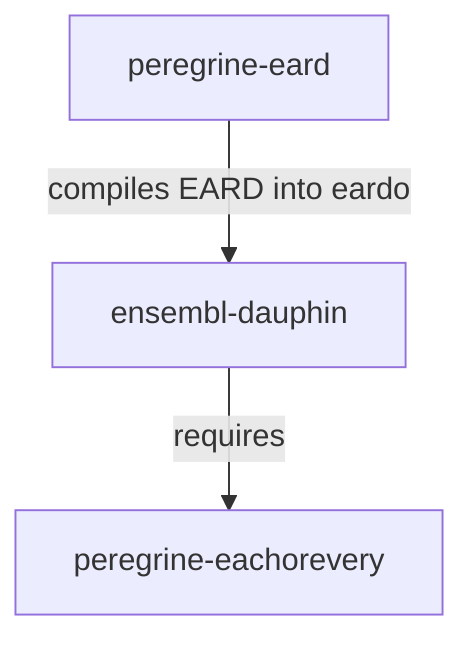
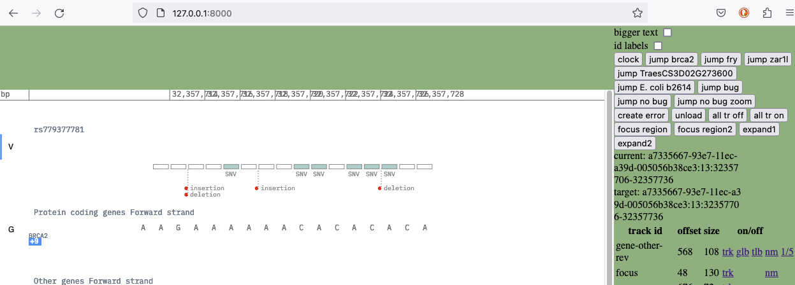
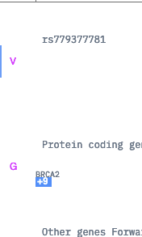

# Peregrine Genome Browser

Peregrine is a WASM / WebGL based genome browser written in Rust. 

### Technology Architecture

The following diagram was taken from [tech-arch.md](peregrine-guide/tech-arch.md) found in `peregrine-guide`



## Further reading

### Guide

`peregrine-guide` contains a set of markdown files detailing use, maintenance, modification, and improvement of the Peregrine genome browser. It has a [main page](peregrin-guide/main.md) that provides an introduction as well as links to other topics. 

###  Doc

`doc` contains a set of text and markdown files detailing specific elements of the browser

### Other repositories

Information on inbuilt EARD functions can be found [here](https://github.com/Ensembl/peregrine-eard/blob/main/docs/library-ref-source.txt)

## Getting started 

### Requirements

To build and run the browser locally you will need the following :- 

- Python 3
- Rust
- wasm-pack (`cargo install wasm-pack`)
- Docker
- Docker compose

A detailed view can be seen [here](peregrine-guide/developer-requirements.md)

### Setup

Three projects need to be cloned in order to develop the browser. These projects need to be cloned to the same root path as they contain relative paths to each other.

1. [ensembl-dauphin-style-compiler](https://github.com/Ensembl/ensembl-dauphin-style-compiler)


 
### Configuration

**Setup and start the back end service**

1. Go to `/ensembl-dauphin-style-compiler/configurations/dev`
2. Copy `sample.env` to `.env`
3. Update `.env` with sensible temp directory paths on your machine. For example `LOG_DIR=/home/dan/tmp/logs` could become `LOG_DIR=/Users/jon/tmp/logs`
4. Start the back end service by calling `docker-compose up`. Remember to use **-d** to detach if you want the service to run in the background

**Setup and start the genome browser test harness** 

1. Go to `ensembl-dauphin-style-compiler/peregrine-generic`
2. Call `./build.sh` this will ask you a set of questions about debugging output and port details. Once you accept the settings it will build the browser and start a server on the port you specified. If you are unsure what settings to use you can do with the default / suggested settings
3. Go to http://127.0.0.1:PORT replacing PORT with the one defined during **2.** 
4. Open `ensembl-dauphin-style-compiler/peregrine-generic/index.html` and check if `backend_url` is pointing to the local backend server that you started in the previous section.

Once you have ran `./build.sh` you can start the front end service by using `python server.py PORT`, ` python -m http.server PORT` or any other http server. 

You should now see something like this :-



**Updating EARD files and testing the changes**

1. EARD files can be found in `ensembl-dauphin-style-compiler/backend-server/egs-data/egs`
2. Make what ever changes you desire.
3. Once you have made your changes you can build them by running `docker exec dev-eard-complier-1 ./build-begs.sh`
7. Refresh the browser to see the changes you have made.

### Testing your setup

Once you have setup the above you should be able to make changes to the EARD files and see the changes in the test harness. The following steps provide a quick way of confirming that everything is setup for developing styles for the browser.

1. Update `ensembl-dauphin-style-compiler/backend-server/egs-data/egs/v16/common/track-common.eard`
2. Change `colour!("#000")` to `colour!("#FF00FF")` on [line 44](https://github.com/Ensembl/ensembl-dauphin-style-compiler/blob/22f194d70830290c149f4a1b5db388cb54bdcbc8/backend-server/egs-data/egs/v16/common/track-common.eard#L44)
```eard 
export procedure draw_track_category(category,track_ids,leafs) {
    capture variety_trackhover;

    let cat_text_size = 12;
    let cat_text_colour = colour!("#000");

    let count = len(leafs);
    let enough_zeros = repeat(0,count);
...
```
4. run `docker exec dev-eard-complier-1 ./build-begs.sh`
5. refresh your browser

You should now see that the track category letters on the left hand side are now magenta `#FF00FF` as seen below




### Data

For the dev configuration of the back end server the data used to power the browser is taken from `ensembl-2020-gb-flatfiles.s3.eu-west-2.amazonaws.com`. This is defined in `/ensembl-dauphin-style-compiler/configurations/dev.docker-compose.override.yml` [on line 63](https://github.com/Ensembl/ensembl-dauphin-style-compiler/blob/22f194d70830290c149f4a1b5db388cb54bdcbc8/configurations/dev/docker-compose.override.yml#L63) as part of the **nginx** configuration.
